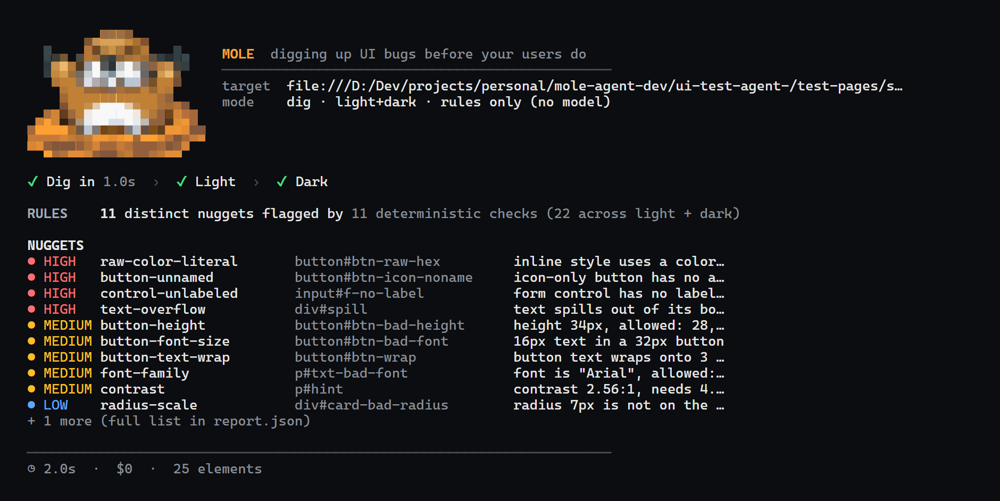
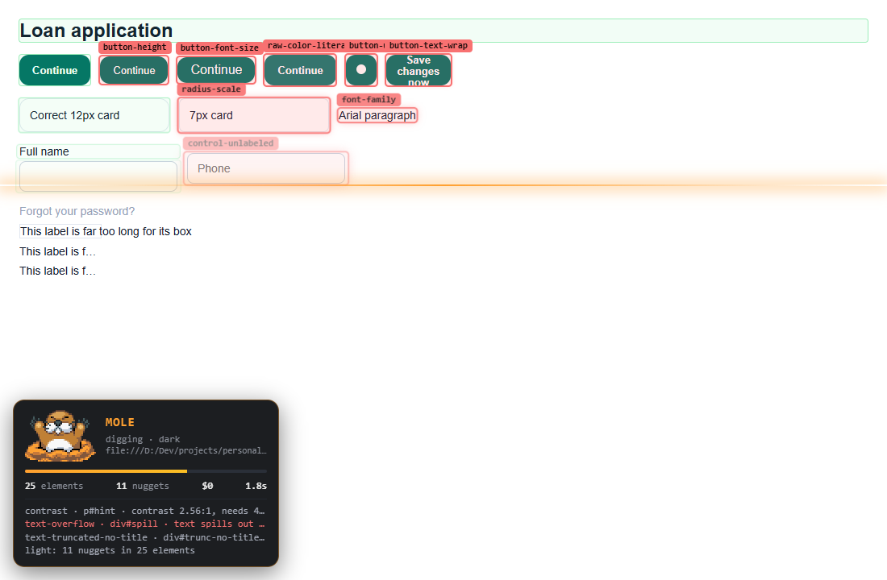
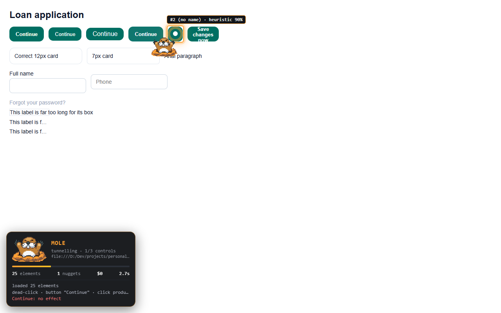

<p align="center">
  
</p>

<h1 align="center">Mole</h1>
<p align="center"><b>Digs up UI bugs before your users do.</b></p>

Mole drives a real browser against your running app and reports **distinct, evidence-backed UI defects**: design-system
violations in light and dark mode, and controls that do nothing, throw errors or fail requests. Deterministic rules find the
facts; a **Jev → Claude → human** ladder judges them, so the fast cheap model settles the obvious cases and the expensive one
only sees the doubtful ones. Every run is timed, costed and replayable.

```bash
mole dig http://localhost:5200/dashboard            # what's wrong on this page?
mole dig <url> --watch                              # the same, in a real browser, live
mole tunnel <url>                                   # do its buttons actually work?
mole ci --urls urls.txt --out evidence/runs/<id>    # pipeline gate: exit 0 clean · 1 defects · 2 not run
```

## See it work

**In the terminal** (live view; one line per event when piped or in CI):



**In the browser** (`--watch`): a laser sweeps the page as every element is checked, green boxes pass, red boxes are defects
with the rule on them, and the mole keeps a running feed of who decided what.



**Tunnelling**: the mole walks to each control; badges show which model picked it and whether the safety screen allowed the click.



Everything on screen is driven by real events from the run. Nothing is scripted; add `--record` for a video.

## Quick start

```bash
npm ci && npx playwright install chromium     # an installed Chrome or Edge works too
cp .env.example .env                          # optional keys: TYPESAFE_API_KEY (Jev), ANTHROPIC_API_KEY (Claude)
npm link                                      # optional: puts `mole` on your PATH
mole doctor                                   # ticks, warnings and the exact fix for anything missing
mole dig http://localhost:3000
```

No keys? Mole still runs its 11 deterministic checks for free (`--no-model`). With both keys it uses the ladder by default.

## Use it from Claude Code

This repository is a Claude Code plugin **and** an MCP server:

```text
/plugin marketplace add <path-or-git-url-of-this-repo>
/plugin install mole@mole
```

| You get | What it does |
| :- | :- |
| `/mole:dig <url>` | scan a page, summarise the defects, offer to fix them |
| `/mole:tunnel <url>` | click through controls, report dead buttons / JS errors / failed requests |
| `/mole:watch <url>` | open the live browser view (great for showing someone) |
| `/mole:doctor` | is this machine ready? |
| MCP tools `mole_dig` `mole_tunnel` `mole_doctor` `mole_report` | Claude calls them itself after changing UI; structured results, progress streamed |
| the `mole` skill | teaches Claude when to test, how to read results, and that **NOT RUN is never a pass** |

Without the plugin: `claude mcp add mole -- node /path/to/repo/bin/mole.mjs mcp`.

## How it decides

```
 page ──▶ 11 deterministic rules (measured from painted pixels: contrast, font, size, labels, overflow, radius, colours)
              │  a finding = a fact with a measurement, e.g. "contrast 4.43:1, needs 4.5:1"
              ▼
          Jev  (fast, cheap, calibrated)  ── confident? ──▶ settled
              │ unsure
              ▼
         Claude (only the doubtful ones)  ── unsure / down? ──▶ a person
```

- Confirming a defect needs confidence ≥ 0.8; **dismissing needs ≥ 0.9**, because wrongly dismissing a real bug is the costly mistake.
- The same defect in light and dark is judged once and the verdict is shared: half the model calls.
- The click-through has a **safety screen** (Jev, then Claude, then fail-safe skip) so it stays away from delete / pay / logout, in English and Mongolian. Nothing is typed or submitted.
- Spend is capped per run (`BUDGET_USD`) and every model call is metered, including the safety screen.

## Exit codes: a contract for pipelines

| Code | Meaning |
| :- | :- |
| `0` | every page tested and clean |
| `1` | defects found |
| `2` | **not run**: login wall, app down, blank page, missing session. Nothing (or not everything) was tested, so it fails |

`mole ci` writes an evidence folder (`summary.json`, per-page reports, screenshots, traces) so a pipeline stage can attach proof
instead of trusting a sentence.

## Proof, not promises

```bash
npm test               # every test, no keys needed (model calls are mocked)
npm run evidence       # tests + mutation benchmark + determinism + smoke
```

Measured on this repository (see `docs/internal/WORK-STATUS.md` for real-app findings and their honest limits):

| What | Result |
| :- | :- |
| tests | 160+ passing, including "the benchmark can fail" (sabotaged rules must be caught) |
| mutation benchmark | 220 generated pages, one injected defect each: precision 1, recall 1, exact-match 100%, 0.0% false positives on clean pages |
| determinism | 11/11 pages identical across 20 fresh runs |
| seeded-bug smoke | 11/11 caught |

The benchmark is synthetic: it proves rule accuracy, not generalisation to real apps. Model accuracy on real findings needs
human labels (`docs/LABELLING.md`) and is reported as **not yet measured** until then.

## Project layout

```
bin/  src/{core,engine,models,eval,ui,cli,mcp}/  plugin/  .claude-plugin/  scripts/{quality,eval,dev}/
test/ (mirrors src)  config/  bench/  eval/  test-pages/  assets/  docs/
```

Dependencies point down only and a test enforces it. Read [`docs/ARCHITECTURE.md`](docs/ARCHITECTURE.md) before adding a
command, rule, event or surface. Setup details: [`docs/SETUP.md`](docs/SETUP.md).

## License

ISC
